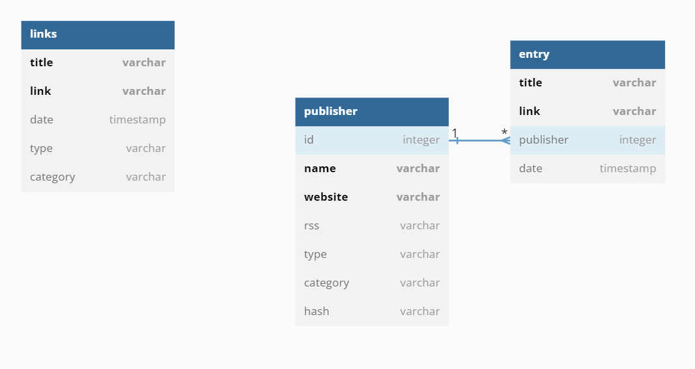

# Content Manager

This project is meant to be an attempt to build a personal content manager that is simple and easy to use and learn something about databases, APIs and how to build a command line interface with Python in the meantime. It is built around what were my personal needs at the time i decided to start working on it.

It is built around a mysql database, which we communicate with through an API. There is also a 
command-line interface that allows you to interact with the database directly from the command line (as an example when you want to save a link to an interesting article you were reading on your computer). If you are on windows you will be able to use the batch files to automate the tasks of updating the database with the weekly rss entries we want to add.

There are 2 use cases for this system:
1 - You want to save a link in your personal database 
2 - You want to automatically insert the new entries of the rss feed of the creators you follow
3 - You can automatically save links that you sent yourself via email

The database has the following schema:



So this means that when we refer to Publishers later on we are referring to the content creators whose rss feeds we want to parse and whose content we want to save in the  ENTRY table.

## Installation
To get the project up and running follow these steps:

1 - Clone the repo, setup a venv and install requirements

```shell
git clone https://github.com/alexcaldarone/content_manager.git
cd content_manager
python -m venv venv
venv\Scripts\activate
pip install -r requirements.txt
```
These commands work on Windows, if you are on a different operating system the commands to activate teh virtual environment will vary.

2 - Create the database
Open the mysql console and run the following commands
```mysql
create database content_manager;
use content_manager;
source [path to project]/sql/db_dump.sql
```

3 - Create a .env file inside the content_manager folder (the folder where we created the virtual environment) and write the following information inside it:
```
gmailUserEmail = "your_email"
gmailAppPassword = "app_password"
dbUserName = "database_username"
dbPassword = "database_password"
```
The gmailAppPassword **is not your gmail account password** but a specific password to allow your script to communicate with gmail. You can read [Google's documentation](https://support.google.com/accounts/answer/185833?hl=en) on how to create one.
I advise that you create a filter inside your gmail client where you redirect all the emails where you send yoursel the links. I have personally created a dummy email account using SimpleLogin where I send the emails to (if you don't know how this works look them up) and then created a filter in Gmail where all the emails coming from that email are labelled as "Links". (This makes it easier when we actually read the inbox using Python because we don't have to do any filtering ourselves, all we have to do is connect to the "Links" server).

You are ready to use the content manager!

## Usage
This content manager can be used for:

1 - Insert links in the database from the command line (make sure the venv is running). This can be done with the following command:
```shell
python cli.py addlink -t [type of link] -c [category] link
```
For more details you can use the help command
```shell
python cli.py --help
```

2 - Add a new publisher we want to follow
```shell
python cli.py add-publisher -t [type of publisher] -c [category] name website rss_feed
```
Example:
```
python cli.py add-publisher -t newsletter -c economics Noahpinion https://noahpinion.substack.com/ https://noahpinion.substack.com/feed
```

3 - Update our ENTRY table on a weekly basis 

This can be done with the weekly_entry_update.bat file. You can schedule the execution using the Task Scheduler.

4 - Daily update of the LINKS table

This feature was born because I found myself reading articles I wanted to save on my phone rather than on my pc. With the add_from_email.bat file (which can also be scheduled with the windows task scheduler) I can check daily the email inbox where I send myself the links I want to save and if there are any emails sent today (as in the day when you run the add_from_email.bat file) it will add the links contained in those emails to the LINKS table.
